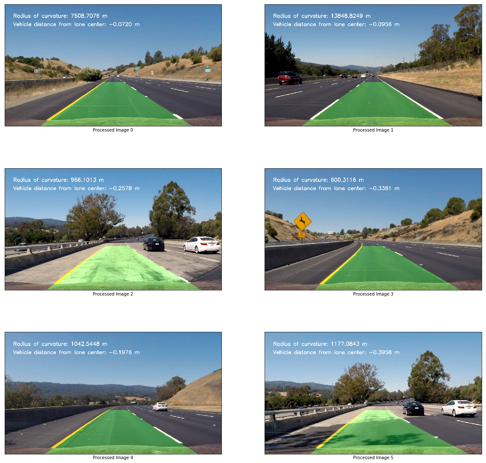

**Advanced Lane Finding Project**

The goals / steps of this project are the following:

* Compute the camera calibration matrix and distortion coefficients given a set of chessboard images.
* Apply a distortion correction to raw images.
* Use color transforms, gradients, etc., to create a thresholded binary image.
* Apply a perspective transform to rectify binary image ("birds-eye view").
* Detect lane pixels and fit to find the lane boundary.
* Determine the curvature of the lane and vehicle position with respect to center.
* Warp the detected lane boundaries back onto the original image.
* Output visual display of the lane boundaries and numerical estimation of lane curvature and vehicle position.

### Camera Calibration

#### 1. Camera calibration using calibration images.

The code for this step is contained in the 1-3 code cell of the IPython notebook.  

I start by preparing "object points", which will be the (x, y, z) coordinates of the chessboard corners in the world. Here I am assuming the chessboard is fixed on the (x, y) plane at z=0, such that the object points are the same for each calibration image.  Thus, `objp` is just a replicated array of coordinates, and `objpoints` will be appended with a copy of it every time I successfully detect all chessboard corners in a test image.  `imgpoints` will be appended with the (x, y) pixel position of each of the corners in the image plane with each successful chessboard detection.  

I then used the output `objpoints` and `imgpoints` to compute the camera calibration and distortion coefficients using the `cv2.calibrateCamera()` function.  I applied this distortion correction to the test image using the `cv2.undistort()` function and obtained this result: 


### Pipeline (single images)

#### 1. Undistort the image
To demonstrate this step, I will describe how I apply the distortion correction to one of the test images like this one:


#### 2. Threshold the image
The thresholding functions are in code cell 4 and 5 of the jupyter notebook.  
I used a combination of color and gradient thresholds to generate a binary image.  
Below is an example of my output for this step. The first image is the original image. The second is the thresholded image.  
In the third image, the blue color is the contribution from the color thresholding, while the green color is the contribution from the grayscale thresholding.


#### 3. Perspective Transform
The perspective transform function is in the code cell 15, the corner selection is in code cell 10 to 14 of the jupyter notebook.

Corner selection on the sample images:


Transformed image:


#### 4. Lane line detection
The lane line detection functions are in code cell 19 and 20.
The function in code cell 19 is using sliding window to find the lines.  
The function in code cell 20 takes in a precalculated polynomial fit and try to detect line starting from the line from the ply fit.
Example of the polynomial line fit superimposed on the warped image:  
With sliding windows:

Without sliding windows:


#### 5. Curvature measurement
The code for measuring curvature, lane center and vehicle distance from lane center is in code cell 21.

#### 6. Sample image with lane highlighted and annotated with lane curvature and vehicle distance from center
The function to draw line on the frame is in code cell 28-30.  
The code to draw line on sample images is in code cell 35.


#### 7. Final Pipeline Step
The code for pipeline function is in code cell 32, 33, 34.  

1. Undistort, threshold and perspective transform the image
2. If there is no history (or first frame), find lane line with sliding windows
3. If there is existing poly fit, find lane line starting from the existing poly fit.
3. Measure curvature
4. Do Sanity Check:
   - Check lane width (if width is out of range, reset)
   - Check curvature (if either left or right curvature is less than 200m, reset).
     There is no tight turn in the video, so it must be false detection.
   - Check sign on the first term of the polynomial equation (if sign changes from - to + or vice versa, reset)
     If there is sign change, meaning left turn change to right turn or vice versa, the existing polynomial fit
     will not fit nicely.
   Reset means go to #2
5. Record polynomial fit and the x values of the line fit.
   Keep history of 5 frames.
6. Draw lane using the average fit from the last 5 frames to reduce jitter.


### Pipeline (video)

#### 1. Link to video

Here's a [link to my video result](./project_video_out.mp4)


### Discussion

#### 1. Briefly discuss any problems / issues you faced in your implementation of this project.  Where will your pipeline likely fail?  What could you do to make it more robust?
One of the most important step in this project is the thresholding of the image. The pipeline is likely to fail where the contrast between the line and the road are not good or covered by shadows, etc. For improvement, need to find a thresholding method that produce clear lines so that the lanes can be detected with more confidence.
The sanity checks can be improved, although for this project they work pretty well.


```python

```
